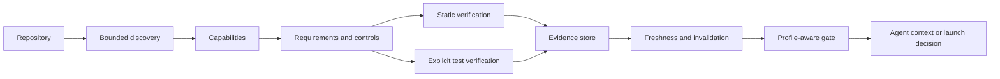

# ProductionOS launch materials

The repository and v0.1.1 release are public. The copy below remains maintained draft launch material unless separately published.

## Positioning

ProductionOS is a local-first production-engineering layer for AI coding agents. It maps a repository to capabilities and requirements, evaluates relevant controls, and keeps verification evidence separate from an agent's claim that a change is finished.

The v0.1 release is deliberately narrow: TypeScript/Next.js-centered discovery, deterministic controls, local evidence, profile-aware gates, one low-risk remediation, and a reproducible flawed fixture.

## Architecture diagram



## Reproducible demo plan

From a clean checkout:

```bash
npm install
npm test
npm run benchmark
npm run demo
```

The benchmark copies `fixtures/nextjs-saas` to a temporary directory, runs inspection/audit plus its configured verification, remediation, and regression contracts, and compares actual findings with the checked-in case contract. `npm run demo` runs the full evidence-backed workflow against a separate temporary copy and expects the flawed target's gate to block. The current measured snapshot is in [`benchmarks/REPORT.md`](../benchmarks/REPORT.md).

For a live terminal demonstration:

```bash
node dist/apps/cli/src/main.js init --root fixtures/nextjs-saas
node dist/apps/cli/src/main.js inspect --root fixtures/nextjs-saas
node dist/apps/cli/src/main.js audit --root fixtures/nextjs-saas --verbose
node dist/apps/cli/src/main.js verify --root fixtures/nextjs-saas --run-tests
node dist/apps/cli/src/main.js gate --root fixtures/nextjs-saas
```

The final command is expected to block on the fixture's unresolved critical findings. That output is generated from the fixture and current engine state, not embedded sample text.

## Before/after example

The supported low-risk remediation is intentionally plan-first:

```bash
node dist/apps/cli/src/main.js fix SEC-HEADERS-001 --root /path/to/next-app
node dist/apps/cli/src/main.js fix SEC-HEADERS-001 --root /path/to/next-app --apply
```

Before applying, the plan states its preconditions, target file, verification command, and rollback. The implementation refuses to overwrite an existing middleware file. After applying, rerun `inspect`, `audit`, and `verify`; the gate must be rerun separately. Unsupported controls return an explicit plan instead of pretending to have been fixed.

The clean temporary-fixture smoke run on 2026-09-14 returned `APPLIED`, created `middleware.ts`, and promoted `SEC-HEADERS-001` to `STATICALLY_VERIFIED` after the follow-up verification. Other findings in the intentionally flawed fixture remained independent and were not hidden by the remediation.

## Short launch post draft

> ProductionOS is an open-source, local-first production-engineering layer for AI coding agents. It discovers what a repository actually contains, activates only the controls relevant to those capabilities, and records evidence separately from an agent's assertion that the work is complete. The first release is a small TypeScript/Next.js-centered CLI with deterministic discovery, profile-aware gates, stale-evidence detection, a reproducible flawed SaaS fixture, and a measured benchmark. It does not upload repositories or claim compliance certification.

## Technical deep-dive draft

The important design choice is the boundary between analysis and proof. Discovery produces bounded facts. The capability and requirement graphs explain why a control is active. Policy evaluation produces findings, while static checks and explicit test runs produce evidence records with provenance and input fingerprints. When relevant files change, old evidence becomes stale rather than silently remaining valid. A profile-aware gate then makes the release decision and leaves waivers visible.

The v0.1 engine is intentionally local-first and framework-focused. Hosted dashboards, broad automated remediation, broad runtime probes, attack/chaos modes, and external load testing are outside the release boundary. The project is released under Apache-2.0.

## Show HN draft

**Title:** Show HN: ProductionOS — evidence-first production checks for AI coding agents

**Body:** I built ProductionOS because an agent can make a feature look finished while leaving the production requirements implicit. The CLI maps a local repository to capabilities and requirements, runs deterministic controls, keeps test/static evidence separate from findings, invalidates stale proof, and returns a profile-aware gate. The repo includes a deliberately flawed Next.js SaaS fixture and a benchmark that runs against actual output. I would value feedback on the control contracts and on where the local-first boundary should expand.

## Reddit / developer community draft

I made a small local-first tool for the gap between “the code works” and “the application is ready for real users.” ProductionOS focuses on evidence: discover the stack and capabilities, activate relevant controls, run static or explicit test verification, invalidate stale evidence, measure explicitly authorized local endpoints, and gate by maturity profile. The first fixture is intentionally broken so the demo shows real blocking findings instead of a green mock. Feedback on false-positive boundaries and useful controls is welcome.

## X / LinkedIn draft

AI coding agents can ship features quickly. ProductionOS asks what those features need to survive real users, ties requirements to repository evidence, and blocks when the proof is missing. Local-first, deterministic, and intentionally honest about what v0.1 does not yet cover.
